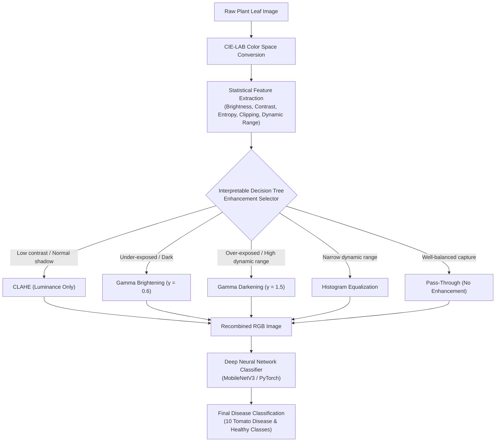

# 🌿 Adaptive Preprocessing Framework for Plant Leaf Disease Classification

[](https://www.python.org/)
[](https://pytorch.org/)
[](https://opencv.org/)
[](https://scikit-learn.org/)
[](LICENSE)

An intelligent, interpretable computer vision framework that dynamically determines whether an agricultural leaf image requires enhancement and selects the most optimal image preprocessing technique on a per-sample basis using an image-statistics-driven Decision Tree.

---

## 📌 Overview & Research Motivation

In traditional deep learning pipelines for agricultural disease diagnosis, preprocessing is treated as a **one-size-fits-all** step:
- Either **no enhancement** is applied, leaving under-exposed, shadowed, or low-contrast field captures degraded.
- Or a **blanket enhancement** (e.g., standard Histogram Equalization or CLAHE) is applied to all images, which frequently blows out highlights, over-saturates healthy tissue, and washes out subtle fungal lesions.

### The Solution: Adaptive Multi-Threshold Preprocessing
This framework solves the limitation by introducing an **adaptive decision pipeline**:
1. **Luminance-Only Processing**: Transforms leaf images to CIE-LAB color space and processes strictly the luminance ($L^*$) channel, preserving delicate chlorophyll pigments and disease coloration ($a^*, b^*$).
2. **Statistical Feature Extraction**: Extracts 6 statistical properties (entropy, brightness, RMS contrast, shadow clipping, highlight clipping, dynamic range) without using class labels.
3. **Interpretable Decision Tree Selector**: Dynamically routes each image to the optimal enhancement method (`none`, `clahe`, `gamma_bright`, `gamma_dark`, or `hist_eq`).
4. **Leakage-Aware Evaluation**: Employs physical leaf identification grouping (`leaf-map.json`) to prevent cross-split data leakage, guaranteeing true generalization to unseen leaves.

---

## 🏗️ Architecture & Pipeline



---

## 📊 Experimental Results & Benchmarks

The framework was evaluated on the **PlantVillage Tomato Dataset** (2,731 test images across 10 classes) using strict physical leaf separation.

| Preprocessing Strategy | Accuracy (%) | Macro Precision | Macro Recall | Macro F1 | Selected Samples |
| :--- | :---: | :---: | :---: | :---: | :---: |
| **No Enhancement (`none`)** | 99.27% | 0.9913 | 0.9904 | 0.9908 | 2,731 |
| **CLAHE (Uniform)** | 99.08% | 0.9899 | 0.9880 | 0.9888 | 2,731 |
| **Gamma Brightening (Uniform, $\gamma=0.6$)** | **99.38%** | **0.9928** | **0.9919** | **0.9922** | 2,731 |
| **Gamma Darkening (Uniform, $\gamma=1.5$)** | 99.19% | 0.9908 | 0.9892 | 0.9898 | 2,731 |
| **Histogram Equalization (Uniform)** | 98.90% | 0.9863 | 0.9830 | 0.9844 | 2,731 |
| **Adaptive Selector (Proposed)** | **99.01%** | **0.9895** | **0.9862** | **0.9877** | *Dynamic Distribution* |

### Adaptive Selector Method Distribution (Test Set)
- **CLAHE**: 1,044 images (38.2%)
- **Gamma Brightening**: 1,033 images (37.8%)
- **Histogram Equalization**: 304 images (11.1%)
- **None**: 215 images (7.9%)
- **Gamma Darkening**: 135 images (4.9%)

---

## 🔍 Interpretable Decision Tree Rules

Unlike opaque black-box preprocessing, the decision rules can be inspected and verified by agronomists:

```text
|--- shadow_clip <= 0.00
|   |--- entropy <= 0.89
|   |   |--- entropy <= 0.85
|   |   |   |--- brightness <= 0.50 -> gamma_bright
|   |   |   |--- brightness >  0.50 -> clahe
|   |   |--- entropy >  0.85
|   |   |   |--- shadow_clip <= 0.00 -> clahe
|   |   |   |--- shadow_clip >  0.00 -> gamma_dark
|   |--- entropy >  0.89
|   |   |--- entropy <= 0.95
|   |   |   |--- brightness <= 0.56 -> gamma_bright
|   |   |   |--- brightness >  0.56 -> hist_eq
|   |   |--- entropy >  0.95 -> clahe
|--- shadow_clip >  0.00
|   |--- entropy <= 0.92
|   |   |--- brightness <= 0.40 -> gamma_bright
|   |   |--- brightness >  0.40
|   |   |   |--- dynamic_range <= 0.70 -> hist_eq
|   |   |   |--- dynamic_range >  0.70 -> gamma_dark
|   |--- entropy >  0.92
|   |   |--- contrast <= 0.22 -> none
|   |   |--- contrast >  0.22
|   |   |   |--- dynamic_range <= 0.74 -> gamma_dark
|   |   |   |--- dynamic_range >  0.74 -> none
```

---

## 🍅 Target Classes (Tomato Diseases)

1. `Tomato___Bacterial_spot`
2. `Tomato___Early_blight`
3. `Tomato___Late_blight`
4. `Tomato___Leaf_Mold`
5. `Tomato___Septoria_leaf_spot`
6. `Tomato___Spider_mites Two-spotted_spider_mite`
7. `Tomato___Target_Spot`
8. `Tomato___Tomato_Yellow_Leaf_Curl_Virus`
9. `Tomato___Tomato_mosaic_virus`
10. `Tomato___healthy`

---

## 📁 Repository Structure

```text
Plant-Disease-Project/
├── adaptive_preprocessing_framework.py  # Complete end-to-end training & evaluation framework
├── adaptive_plant_disease.py            # Modular pipeline (feature extraction, tree calibration)
├── prepare_tomato_dataset.py            # Leakage-aware 70/15/15 dataset partitioner with leaf-map
├── plant_disease_train.ipynb            # Interactive exploration and training notebook
├── plant_model_final.pt                 # Pretrained deep learning model weights (~16 MB)
├── adaptive_selector_final.joblib       # Serialized trained Decision Tree selector
├── decision_tree_rules.txt              # Human-readable decision tree rule export
├── final_results.json                   # Comprehensive metrics, confusion matrices, class reports
├── training_history.csv                 # Epoch-by-epoch loss and accuracy metrics
├── requirements.txt                     # Pinned project dependencies
└── README.md                            # Project documentation
```

---

## 🚀 Getting Started

### 1. Prerequisites & Installation

Clone this repository and create a Python virtual environment:

```bash
git clone https://github.com/DrGenuisCodist7/Plant-Disease-Project.git
cd Plant-Disease-Project

python -m venv venv
# On Windows:
.\venv\Scripts\activate
# On Linux/macOS:
source venv/bin/activate

pip install -r requirements.txt
```

### 2. Dataset Setup (Leakage-Aware Partitioning)

Download the [PlantVillage Dataset](https://github.com/spMohanty/PlantVillage-Dataset) and place it in the project root:

```bash
python prepare_tomato_dataset.py
```
This partitions tomato images into `dataset/train/`, `dataset/val/`, and `dataset/test/` while ensuring photos of identical physical leaves stay within the same split.

### 3. Run Training and Evaluation

Execute the unified adaptive preprocessing framework:

```bash
python adaptive_preprocessing_framework.py
```

This will:
- Train the deep classifier with random enhancement augmentations.
- Extract statistical image features and fit the Decision Tree selector on validation data.
- Benchmark all static enhancement techniques against the adaptive selector on the held-out test split.
- Export `final_results.json`, `decision_tree_rules.txt`, and serialized models.

---

## 📈 Training Convergence

| Epoch | Train Loss | Train Accuracy | Validation Loss | Validation Accuracy |
| :---: | :---: | :---: | :---: | :---: |
| 1 | 0.3057 | 91.18% | 0.0328 | 99.05% |
| 2 | 0.0733 | 97.53% | 0.0264 | 99.30% |
| 3 | 0.0517 | 98.37% | 0.0281 | 99.30% |
| 4 | 0.0327 | 98.94% | 0.0301 | 99.16% |
| 5 | 0.0366 | 98.78% | 0.0374 | 98.86% |
| 6 | 0.0230 | 99.25% | 0.0344 | 99.08% |
| **7** | **0.0309** | **99.16%** | **0.0296** | **99.34%** |

---

## 📜 License

This project is licensed under the [MIT License](LICENSE).
